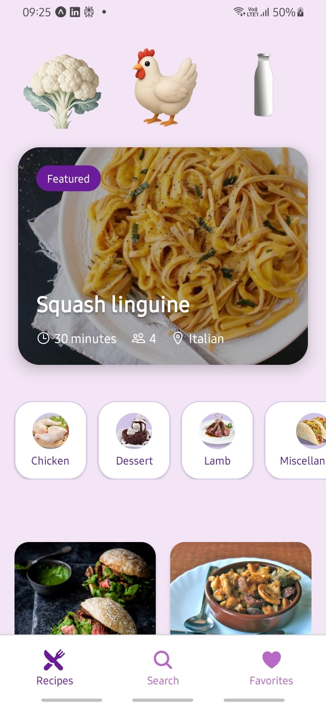
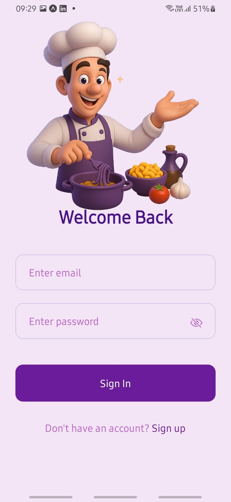
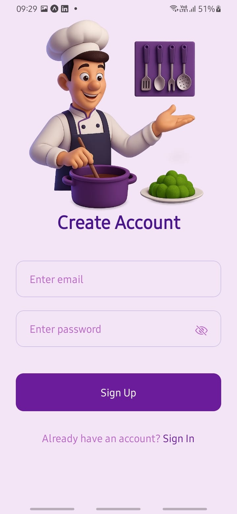
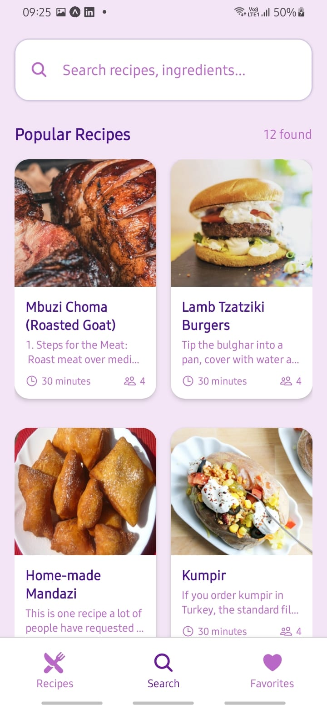

# 🍽️ Recipe Spoon

**Recipe Spoon** is a beautifully designed **React Native app built with Expo** that allows users to discover, search, and follow food recipes with ease. It includes rich features like step-by-step instructions, embedded cooking videos, and a powerful search function. The backend is fully deployed and live on **Render**, making it a seamless experience across devices.

---

## ✨ Features

- 🔍 **Search Recipes**: Instantly find recipes by food name, ingredients, or cuisine type
- 🎥 **Video Recipes**: Watch cooking steps via integrated video player
- 📓 **Step-by-Step Instructions**: Clear directions for each cooking phase
- ❤️ **Save Favorites**: Bookmark and manage favorite recipes
- 📊 **Clean & Responsive UI**: Built using **React Native** and **Expo**
- ✨ **Backend API hosted on Render** for real-time data delivery

---

## 📸 App Screenshots

  
  
  
  
  
  

---

## 🧰 Tech Stack

### Frontend
- [React Native](https://reactnative.dev/)
- [Expo](https://expo.dev/)
- [React Navigation](https://reactnavigation.org/)
- [Axios](https://axios-http.com/)

### Backend
- Node.js + Express.js
- MongoDB with Mongoose
- Deployed on [Render](https://recepie-api.onrender.com/)

---

## 🔗 API Endpoint

> Replace with your actual deployed URL

